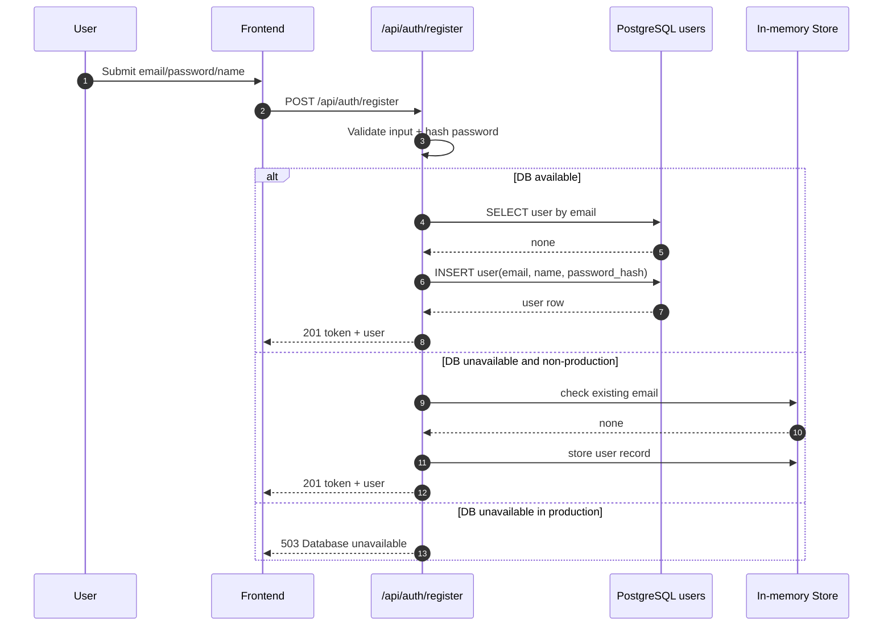

# Agent Orchestration and Integrations Architecture

Date: 2026-04-15

## Current Reality (Implemented Today)

### AI layer
- Frontend entrypoint: `frontend/src/pages/AILayer.jsx`
- Backend route surface: `backend/src/routes/ai.js`
- Supported endpoints:
  - `POST /api/ai/generate`
  - `POST /api/ai/analyze-campaign`
  - `POST /api/ai/suggestions`
- Execution model today: synchronous, user-triggered prompt/response calls.

### Integrations layer
- Service catalog is modeled in `backend/src/models/integration.js` and consumed by `frontend/src/hooks/useIntegrations.js`.
- Credentials are encrypted at rest (`backend/src/services/encryption.js` + `backend/src/models/credential.js`).
- Validation endpoints exist (`/api/integrations/:service/test`, `/api/integrations/validate-all`).

### Hard constraints today
- No autonomous background agent loop.
- No internal scheduler/queue worker for long-running tasks.
- No generalized inbound webhook orchestration pipeline.
- External API-dependent capabilities remain gated by vendor approvals and credentials.

## Long-Term Target (Event-Driven Multi-Agent)

### Domain agent candidates

1. **Growth Agent**
   - **Purpose**: Identify high-intent lead segments and recommend expansion opportunities.
   - **Dependencies**: CRM lead scoring, historical conversion data, external market signals.
   - **Data Path**: Lead attributes + behavioral signals -> scoring model -> growth recommendations.

2. **Content Agent**
   - **Purpose**: Generate and optimize multi-channel campaign assets (ads, emails, WhatsApp).
   - **Dependencies**: Brand voice guidelines, performance feedback from Meta/HubSpot, LLM providers.
   - **Data Path**: Campaign brief + historical performance -> content variants -> human approval -> deployment.

3. **Campaign Monitoring Agent**
   - **Purpose**: Real-time anomaly detection and budget pacing for active ad campaigns.
   - **Dependencies**: Meta Ads Insights API, Google Ads API, internal spend targets.
   - **Data Path**: Hourly spend/performance metrics -> threshold checks -> automated alerts or pause actions.

4. **CRM / Reactivation Agent**
   - **Purpose**: Detect dormant leads or customers and trigger personalized re-engagement flows.
   - **Dependencies**: HubSpot/Salesforce lifecycle events, last-interaction timestamps.
   - **Data Path**: Inactivity detection -> context assembly -> personalized outreach draft -> automated/manual send.

5. **Reporting Agent**
   - **Purpose**: Automate the generation of cross-platform performance summaries and insights.
   - **Dependencies**: Aggregated data from all connected integrations, custom KPI definitions.
   - **Data Path**: Raw integration data -> SQL/vector aggregation -> natural language summary -> delivery.

## Orchestration Layer Blueprint

Principle: event-driven routing over periodic polling.

- Event source: database mutations and integration webhooks.
- Router: backend orchestration module (future) to fan out event payloads to domain handlers.
- State: durable run log (`queued`, `running`, `succeeded`, `failed`) and decision audit trail.
- Guardrails: approval gates for outbound side effects (email/send/update) until reliability targets are met.

## Sequence Diagram (DB-Backed Auth Registration with Fallback)

## Engineering Requirements to Reach Target

1. Implement orchestration persistence (`agent_runs`, `agent_events`, `agent_outputs`).
2. Add webhook ingestion endpoints with signature verification and retry semantics.
3. Introduce worker runtime (queue + backoff + dead-letter handling).
4. Add per-agent policy controls (manual approval, rate limits, budget limits).
5. Add observability for every run (latency, failure reason, external API quota impact).

## Honesty Policy

All UI and docs must explicitly label pending agent behaviors as planned or placeholder until backed by executable code paths and production telemetry.
