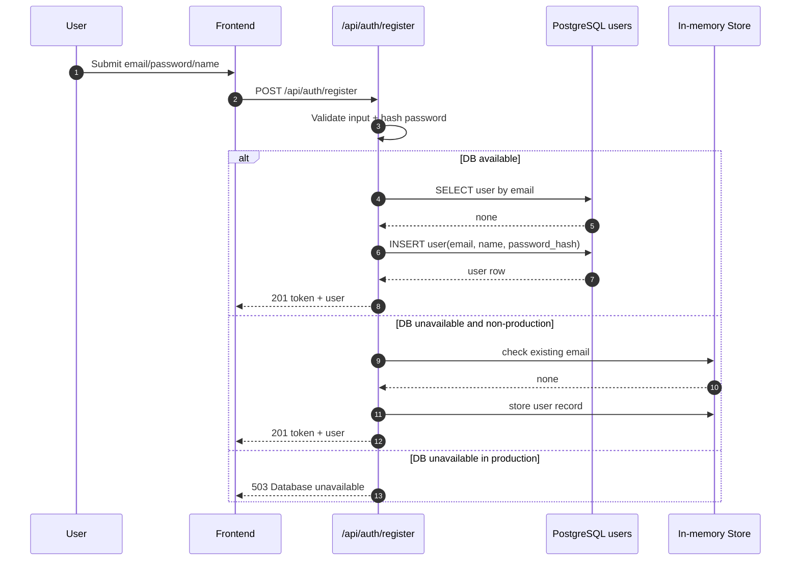

# Agent Orchestration and Integrations Architecture

Date: 2026-04-15

## Current Reality (Implemented Today)

### AI layer
- Frontend entrypoint: `frontend/src/pages/AILayer.jsx`
- Backend route surface: `backend/src/routes/ai.js`
- Supported endpoints:
  - `POST /api/ai/generate`
  - `POST /api/ai/analyze-campaign`
  - `POST /api/ai/suggestions`
- Execution model today: synchronous, user-triggered prompt/response calls.

### Integrations layer
- Service catalog is modeled in `backend/src/models/integration.js` and consumed by `frontend/src/hooks/useIntegrations.js`.
- Credentials are encrypted at rest (`backend/src/services/encryption.js` + `backend/src/models/credential.js`).
- Validation endpoints exist (`/api/integrations/:service/test`, `/api/integrations/validate-all`).

### Hard constraints today
- No autonomous background agent loop.
- No internal scheduler/queue worker for long-running tasks.
- No generalized inbound webhook orchestration pipeline.
- External API-dependent capabilities remain gated by vendor approvals and credentials.

## Long-Term Target (Event-Driven Multi-Agent)

### Domain agent candidates

1. Market and competition intelligence agent
- Purpose: ingest external unstructured signals and produce structured competitor matrices.
- Dependencies: third-party signal ingestion/scraping providers plus vector indexing.
- Data path: normalized external text -> embeddings -> pgvector-backed retrieval.

2. Marketing and content generation agent
- Purpose: generate and optimize campaign assets using performance feedback.
- Dependencies: Meta Graph API read/write scope, campaign telemetry ingestion, outbound delivery tooling.
- Data path: campaign state + historical outcomes -> content variants -> approval -> execution.

3. Sales and CRM follow-up agent
- Purpose: detect lead state transitions and draft contextual follow-up actions/messages.
- Dependencies: durable HubSpot OAuth lifecycle, encrypted token storage, lead timeline context.
- Data path: lead event -> context assembly -> recommendation or draft -> optional human approval.

4. Finance and KPI intelligence agent
- Purpose: deterministic anomaly detection on pipeline and revenue KPIs.
- Dependencies: stable metric views in Postgres, optional federated SQL acceleration.
- Data path: KPI snapshots + trend windows -> rule/stat checks -> actionable alerts.

## Orchestration Layer Blueprint

Principle: event-driven routing over periodic polling.

- Event source: database mutations and integration webhooks.
- Router: backend orchestration module (future) to fan out event payloads to domain handlers.
- State: durable run log (`queued`, `running`, `succeeded`, `failed`) and decision audit trail.
- Guardrails: approval gates for outbound side effects (email/send/update) until reliability targets are met.

## Sequence Diagram (DB-Backed Auth Registration with Fallback)

## Engineering Requirements to Reach Target

1. Implement orchestration persistence (`agent_runs`, `agent_events`, `agent_outputs`).
2. Add webhook ingestion endpoints with signature verification and retry semantics.
3. Introduce worker runtime (queue + backoff + dead-letter handling).
4. Add per-agent policy controls (manual approval, rate limits, budget limits).
5. Add observability for every run (latency, failure reason, external API quota impact).

## Honesty Policy

All UI and docs must explicitly label pending agent behaviors as planned or placeholder until backed by executable code paths and production telemetry.
