# Nuvanx-System Architecture

This document describes the high-level architecture of the Nuvanx System.

## Diagram

**Source of truth**: `docs/architecture.mmd`.

```mermaid
graph TD
  subgraph "Root"
    A["package.json"]
    B["README.md"]
    C[".github/workflows/*"]
    D["supabase/config.toml"]
    E["vercel.json"]
  end

  subgraph "Frontend"
    F["frontend/src/pages/*"]
    G["frontend/src/components/*"]
    H["frontend/src/hooks/*"]
    I["frontend/src/lib/env.ts"]
    J["frontend/src/lib/metaPixel.ts"]
  end

  subgraph "Supabase"
    subgraph "Functions"
      K["supabase/functions/api/index.ts"]
      L["supabase/functions/daily-aggregates/index.ts"]
      M["supabase/functions/mcp/index.ts"]
      N["supabase/functions/_shared/config.ts"]
      O["supabase/functions/_shared/phone.ts"]
    end
    subgraph "Database"
      P["supabase/migrations/*.sql"]
      Q["Operational tables"]
      R["Reporting and traceability views"]
      S["RPC functions"]
    end
  end

  subgraph "Scripts"
    T["scripts/run-daily-sync.js"]
    U["scripts/shared/meta-daily-insights.js"]
    V["scripts/sync-platform-secrets.js"]
    W["scripts/health-check-nuvanx.ts"]
  end

  subgraph "CI/CD"
    C1[".github/workflows/deploy.yml"]
    C2[".github/workflows/ci.yml"]
    C4[".github/workflows/daily-sync.yml"]
    C6[".github/actions/supabase-link-run"]
  end

  subgraph "External Services"
    Y["Supabase Cloud"]
    Z["Vercel"]
    AA["Meta Graph API"]
    AB["Doctoralia exports"]
    AC["Google Sheets / Google Ads"]
    AD["AI providers"]
  end

  A --> F
  A --> K
  A --> T
  D --> K
  D --> L
  D --> M
  F --> K
  K --> N
  K --> O
  L --> N
  M --> N
  K --> Q
  K --> R
  K --> S
  T --> Q
  T --> AB
  T --> AC
  U --> Q
  U --> AA
  C1 --> P
  C1 --> K
  C1 --> L
  C1 --> M
  C2 --> F
  C4 --> T
  C4 --> U
  C6 --> C1
  K --> Y
  L --> Y
  M --> Y
  F --> Z
  K --> AA
  K --> AD
  K --> AC
```

## Key Architectural Notes

### CAPI / Meta Conversions
The API Edge Function is the central hub for server-side event dispatch. Runtime identifiers and tokens must come from environment variables or secrets.

### Daily Data Flow
Daily sync is orchestrated by `scripts/run-daily-sync.js` and `.github/workflows/daily-sync.yml`.

### Monitoring & Quality
Operational health is checked through scripts, workflow logs and Supabase reporting views. Do not embed live account identifiers or secrets in documentation.

## Maintenance Rule
Keep this document aligned with active workflows and source paths only. Do not document removed workflows, historical one-off jobs, generated outputs or local machine files.
