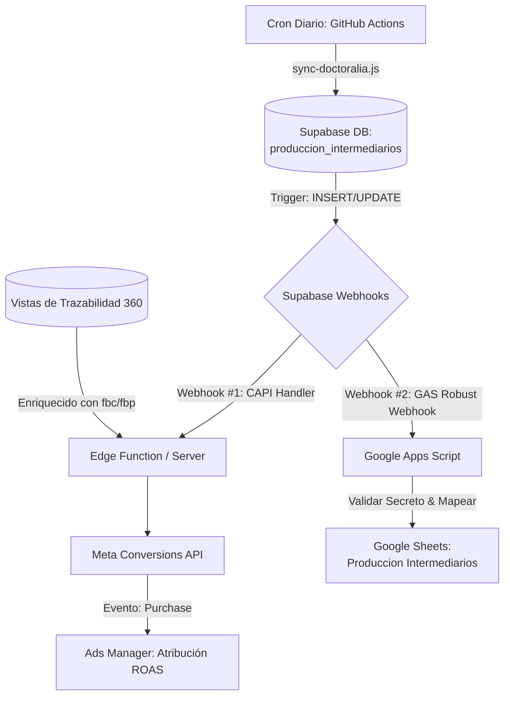

# Nuvanx-System Architecture

This document describes the high-level architecture of the Nuvanx System (Meta Ads + Doctoralia + Supabase + CAPI + AI layer).

## Diagram

```mermaid
graph TD
  subgraph "Root"
    A["package.json"]
    B["README.md"]
    C[".github/workflows/*"]
    D["supabase/config.toml"]
    E["vercel.json"]
  end

  subgraph "Frontend (Vercel)"
    F["frontend/src/pages/*"]
    G["frontend/src/components/*"]
    H["frontend/src/hooks/*"]
    I["frontend/src/lib/env.ts"]
    J["frontend/src/lib/metaPixel.ts"]
  end

  subgraph "Supabase"
    subgraph "Functions (Edge)"
      K["supabase/functions/api/index.ts"]
      L["supabase/functions/daily-aggregates/index.ts"]
      M["supabase/functions/mcp/index.ts"]
      N["supabase/functions/_shared/config.ts"]
      O["supabase/functions/_shared/phone.ts"]
    end
    subgraph "Database"
      P["supabase/migrations/*.sql"]
      Q["Tables: leads, financial_settlements, doctoralia_*,\nmeta_daily_insights, meta_cache, agent_outputs, users, clinics"]
      R["Views: vw_lead_traceability, vw_doctoralia_* ,\nvw_campaign_performance_real, vw_source_comparison,\nvw_financial_patient_production, vw_whatsapp_conversion_real"]
      S["RPC: get_trazabilidad_funnel,\nget_campaign_roi, get_campaigns_filter,\nget_phone_normalization_coverage,\nmatch_*_to_doctoralia_*, reconcile_*"]
    end
  end

  subgraph "Scripts (Node)"
    T["scripts/sync-doctoralia.js\n(Doctoralia → financial_settlements)"]
    U["scripts/shared/meta-daily-insights.js"]
    V["scripts/sync-platform-secrets.js"]
    W["scripts/health-check-nuvanx.ts"]
    X["scripts/verify-meta-access.js"]
  end

  subgraph "CI/CD"
    C1[".github/workflows/deploy.yml\n(Supabase migrate + Edge deploy)"]
    C2[".github/workflows/ci.yml\n(ESLint, tests, build)"]
    C3[".github/workflows/sync-doctoralia.yml\n(cron Doctoralia sync)"]
    C4[".github/workflows/daily-sync.yml\n(Daily orchestrator)"]
    C5["docs/codex/meta-capi-operational-checklist.md"]
  end

  subgraph "External Services"
    Y["Supabase Cloud\n(DB + Edge Runtime)"]
    Z["Vercel\n(Frontend hosting)"]
    AA["Meta Graph API\n(Ads, leadgen, CAPI)"]
    AB["Doctoralia\n(Exports → Sheets)"]
    AC["Google Sheets / Google Ads"]
    AD["OpenAI / Gemini\n(AI layer)"]
    AE["Telegram Bot\n(notifications)"]
  end

  subgraph "Monitoring & Observability"
    AF["/capi/quality (CAPI EMQ monitoring)"]
    AG["[CAPI-QUALITY-ALERT] logs"]
    AH["Daily sync quality logs\n(reconciliation, phone coverage)"]
  end

  %% Root wiring
  A --> F
  A --> K
  A --> T
  D --> K
  D --> L
  D --> M

  %% Frontend to backend
  F -->|"fetch /api/*"| K
  G --> F
  H --> F
  I --> F
  J --> F

  %% Functions to shared + DB
  K --> N
  K --> O
  L --> N
  M --> N
  K --> Q
  K --> R
  K --> S
  K --> AF

  %% Scripts to DB & externals
  T --> Q
  T --> AB
  T --> AC
  U --> Q
  U --> AA
  X --> AA

  %% CI/CD links
  C1 --> P
  C1 --> K
  C1 --> L
  C1 --> M
  C2 --> F
  C3 --> T
  C4 --> T
  C4 --> U
  C5 --> AA
  C5 --> K
  C5 --> AF

  %% Deploy targets
  K --> Y
  L --> Y
  M --> Y
  F --> Z

  %% External integrations
  K --> AA
  K --> AD
  K --> AC
  K --> AE
  T --> AC
  K --> AB
  K --> AC
  K --> AD

  %% Monitoring connections (new)
  AF --> AG
  T --> AH
  K --> AH
```

## Key Architectural Notes (as of latest updates)

### CAPI / Meta Conversions Focus
- The `supabase/functions/api/index.ts` is the central hub for all Meta CAPI events (Lead, Purchase, Contact).
- Strong emphasis on:
  - SHA-256 hashing of PII (`em`, `ph`).
  - Passing `fbc`/`fbp` for high EMQ.
  - Dynamic pixel routing per ad account (`9523446201036125` vs `4172099716404860`).
  - `handleSupabaseWebhook` for server-side `Purchase` events from paid Doctoralia productions.

### Daily Data Flow — Fully Automated & Bidirectional (Critical for CAPI Attribution)

**Full Automatic Bidirectional Flow**

- **Webhook #1 (CAPI)**: Supabase → Edge Function → Meta `Purchase` (with `capi_sent` guard + `fbc`/`fbp` from enriched view).
- **Webhook #2 (Operational Mirror)**: Supabase → Google Apps Script (`docs/google-apps-script/webhook-produccion-intermediarios.js`) → Real-time update of the "Produccion Intermediarios" sheet.
- Robust version of the script is saved at:
  `docs/google-apps-script/webhook-produccion-intermediarios.js`
- **Fully CLI-driven setup**: Use `scripts/setup-supabase-webhooks.js` (Management API) to create both webhooks programmatically.

**Result**: The entire flow (Doctoralia export → Supabase → CAPI Purchase in Meta + live Sheet mirror) runs **100% automatically** after the initial one-time configuration of the two Database Webhooks.

### Monitoring & Quality
- New protected endpoint: `GET /capi/quality` — provides EMQ signal coverage, recent Purchase events, and pixel routing status.
- Quality alerts: `[CAPI-QUALITY-ALERT]` when key signals (`fbc`, `fbp`, `em`, `ph`) are missing.
- Daily sync now emits structured quality logs for phone coverage and reconciliation success.

### Security Posture
- Multiple layers of redaction for sensitive data in logs (especially service account credentials and error messages).
- CodeQL/Sonar issues actively addressed in `sync-doctoralia.js` and related scripts.

## Recent Improvements (May 2026)

- Made Doctoralia daily sync **critical** in the orchestrator (directly impacts reliability of CAPI `Purchase` events from paid productions).
- Added `capi/quality` monitoring endpoint (protected, returns EMQ signal coverage, recent Purchase events, pixel routing).
- Enriched traceability view with `lead_fbc` / `lead_fbp` for better CAPI matching on paid conversions.
- Hardened CAPI event dispatch + removed automatic `demo@nuvanx.com` user fallback for API key requests (security).
- Improved logging around `[CAPI-PROD]` events and daily sync quality metrics.
- All main production paths (CAPI Lead/Purchase, Doctoralia reconciliation, daily sync) are implemented with real data only — no mock/demo data in critical flows.

---

*This diagram is maintained as the single source of truth for the system architecture. Update it when adding major components (new Edge Functions, scripts, or external integrations).*