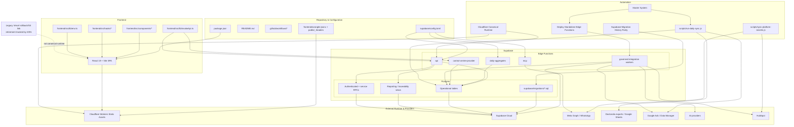

# Nuvanx-System Architecture

This document describes the current high-level architecture of the Nuvanx System.

## Diagram

**Source of truth**: `docs/architecture.mmd`.

```mermaid
graph TD
  subgraph "Repository & Configuration"
    A["package.json"]
    B["README.md"]
    C[".github/workflows/*"]
    D["supabase/config.toml"]
    E["frontend/wrangler.jsonc + public/_headers"]
  end

  subgraph "Frontend"
    F["React 19 + Vite SPA"]
    G["frontend/src/components/*"]
    H["frontend/src/hooks/*"]
    I["frontend/src/lib/env.ts"]
    J["frontend/src/lib/invokeApi.ts"]
  end

  subgraph "Supabase"
    subgraph "Edge Functions"
      K["api"]
      L["daily-aggregates"]
      M["mcp"]
      N["control-centre-provider"]
      O["governed integration workers"]
    end
    subgraph "Postgres"
      P["supabase/migrations/*.sql"]
      Q["Operational tables"]
      R["Reporting / traceability views"]
      S["Authenticated + service RPCs"]
    end
  end

  subgraph "Automation"
    T["scripts/run-daily-sync.js"]
    U["scripts/sync-platform-secrets.js"]
    V["Master System"]
    W["Deploy Standalone Edge Functions"]
    X["Cloudflare Canonical Runtime"]
    X2["Supabase Migration History Parity"]
  end

  subgraph "External Runtime & Providers"
    CF["Cloudflare Workers Static Assets"]
    Y["Supabase Cloud"]
    AA["Meta Graph / WhatsApp"]
    AB["Doctoralia exports / Google Sheets"]
    AC["Google Ads / Data Manager"]
    AD["AI providers"]
    HS["HubSpot"]
  end

  A --> F
  D --> K
  D --> L
  D --> M
  E --> CF
  F --> CF
  G --> F
  H --> F
  I --> F
  J --> K
  J --> N
  K --> Q
  K --> R
  K --> S
  L --> Q
  M --> Y
  N --> Q
  O --> Q
  P --> Y
  Q --> Y
  R --> Y
  S --> Y
  T --> Q
  T --> AB
  T --> AC
  U --> AA
  U --> HS
  V --> W
  V --> T
  W --> O
  X --> CF
  X --> K
  X2 --> P
  O --> AA
  O --> AC
  O --> HS
  O --> AD

  LEG["Legacy Vercel rollback/Git link\nretirement tracked by #391"]
  LEG -. not canonical runtime .-> F
```

## Key Architectural Notes

### Frontend runtime
The canonical frontend is the React/Vite SPA deployed through Cloudflare Workers Static Assets. The frontend talks directly to governed Supabase Auth/Edge endpoints; production API behavior must not depend on Vercel rewrites. Legacy Vercel configuration remains only as a temporary rollback/decommission concern tracked separately.

### CAPI / Meta Conversions
The governed server-side functions own provider event dispatch. Runtime identifiers and tokens must come from environment variables, Vault or approved secret stores; they must not enter browser builds.

### Daily Data Flow
Daily synchronization is orchestrated by `scripts/run-daily-sync.js` under the current `Master System` workflow. Provider-specific workers persist canonical server-side facts in Supabase.

### Deployment ownership
`Master System` is the quality gate. `Deploy Standalone Edge Functions` owns the governed standalone Edge deployment set after a successful main candidate. `Cloudflare Canonical Runtime` continuously proves the public SPA plus authenticated Supabase session/runtime contract. `Supabase Migration History Parity` fails closed on Git↔ledger drift.

### Monitoring & Quality
Operational health is checked through workflow gates, runtime acceptance and Supabase reporting/health views. Do not embed live credentials or private customer/patient data in documentation or CI output.

## Maintenance Rule
Keep this document aligned with active workflows and source paths only. Do not promote retired workflows, historical one-off jobs, generated outputs or local-machine files into architecture ownership.
